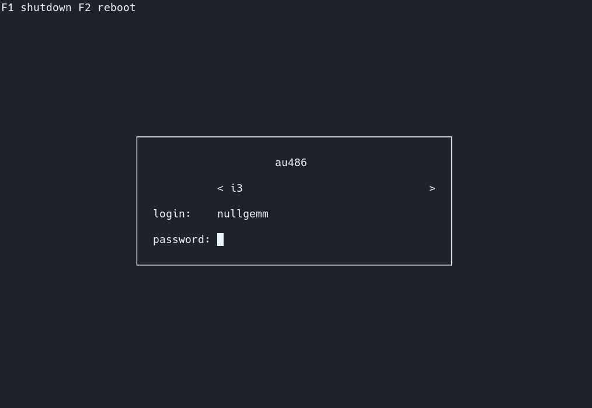

<p align="center"></p>

###### This is not exactly how lydm is shown in my computer, but it's super similar.

# Ly - DM (aur)

Ly is a super minimal display manager, it's the display manager y use sometimes for loging in Arch Linux.

### Installing LY
For installing ly:
```shell
git clone https://github.com/nullgemm/ly.git
cd ly
make github
make
sudo make install
sudo systemctl enable ly.service
sudo systemctl disable getty@tty2.service
```

### Downloading the configuration
The configuration is a simple `.ini` file.
```shell
git clone https://github.com/pablocorbalann/dotfiles pablo-dotfiles
sudo mv pablo-dotfiles/ly/config.ini /etc/ly/config.ini
rm -rf pablo-dotfiles
```
