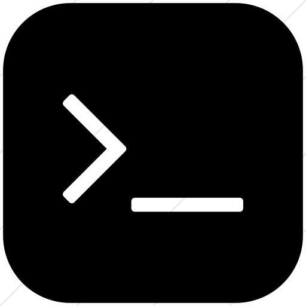
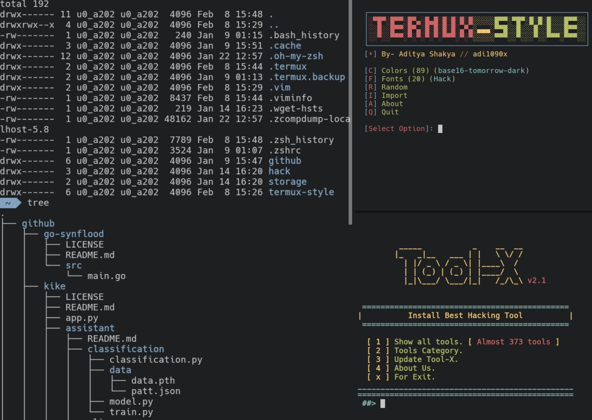

  

# Termux
I have termux installed on my android device, so why not uploading the configuration of it here too?

Termux is an **Android terminal emulator and Linux environment app** that works directly with no rooting or setup required. A minimal base system is installed automatically, but you can install more packages using the package manager

### Instalation
You can install Termux from the play store in an android device.

If you are using F-droid, you can install termux from [here](https://f-droid.org/packages/com.termux/).

### Usage of the configuration
I have not coded any script for automating the process of implementing this configuration to your device, so you'll have to do it by hand.

### Appearence
To personalize termux I use [Termux-style](https://github.com/adi1090x/termux-style), so I'd recommend you to use it.

  

###### left: ls -la && tree; right-top: termux-style; right-bottom: toolx;

###### Limitations on the license
