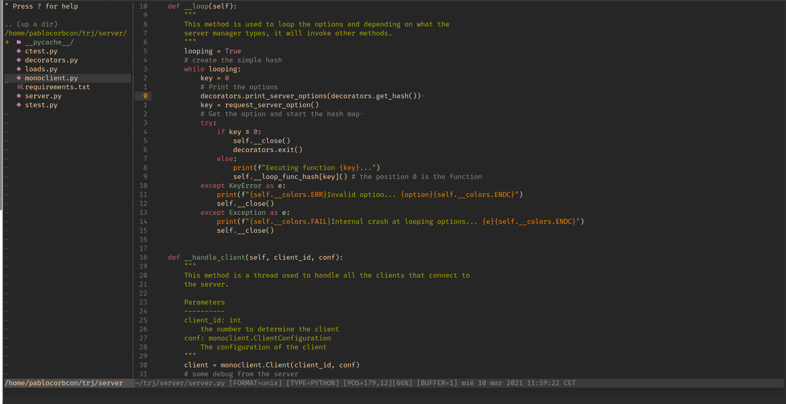

<p align="center">
  
  
</p>
<p align="center"></p>

# Vim
### My Vim personal configuration

In this folder I will store all the **configuration files** that have relation with my **Vim text editor**. Vim is a very configurable console text editor, so it has different files that you can use to modify. You can learn more about Vim [here](https://www.vim.org/).

As an operating system, I use [Arch Linux](https://archlinux.org), so some of the settings in this repository **may not work the same on different Linux distributions** or even on different operating systems.

I use **Vundle-vim** as a plugin manager, you can read more about Vundle-vim in its GitHub [repository](https://github.com/VundleVim/Vundle.vim). You can also use another package manager like [vim-plug](https://github.com/junegunn/vim-plug).

---

### Installing vim

You'll need vim to run this configuration, check out [this page](https://vim.org). For example in Arch Linux:
```shell
sudo pacman -S vim
```

---

### Installing Vundle Vim

I use the vundle vim plugin manager, you'll have to install it using:

```shell
git clone https://github.com/VundleVim/Vunlde.vim.git ~/.vim/bundle/Vundle.vim
```

---

Vim is made up of multiple files. **I have only uploaded to this repository those that I have configured to my liking**. Let's imagine a basic file structure on linux. With vim, it would be something like this:
```
home/<user>
| ...
| .vim/
| | autoload/
| | bundle/
| | views/
| | netrwhist
| .vimrc
```
You can check the structure of vim with a simple
```shell
ls -la
```

You can set up this Vim configuration to your local machine. But you will need some **requisites**. Although Vim is 
| Name | Version |Use | Links |
|------|---------|----|-------|
| Git  | n       | CLonning this repository | [git-scm.com](https://git-scm.com/) |
| Vim  | 8+      | The Vim text editor itself | [vim.org](https://www.vim.org/) |


---

### Using the configuration
For using the configuration, run:
```shell
git clone https://github.com/pablocorbalann/dotfiles.git pablo-dotfiles
mv pablo-dotfiles/vim/.vimrc ~/.vimrc
vim +c PluginInstall
rm -rf pablo-dotfiles
```

The font I use is fira code bold. You can check it at [this repository](https://github.com/tonsky/FiraCode).

###### Limitations under the License.
