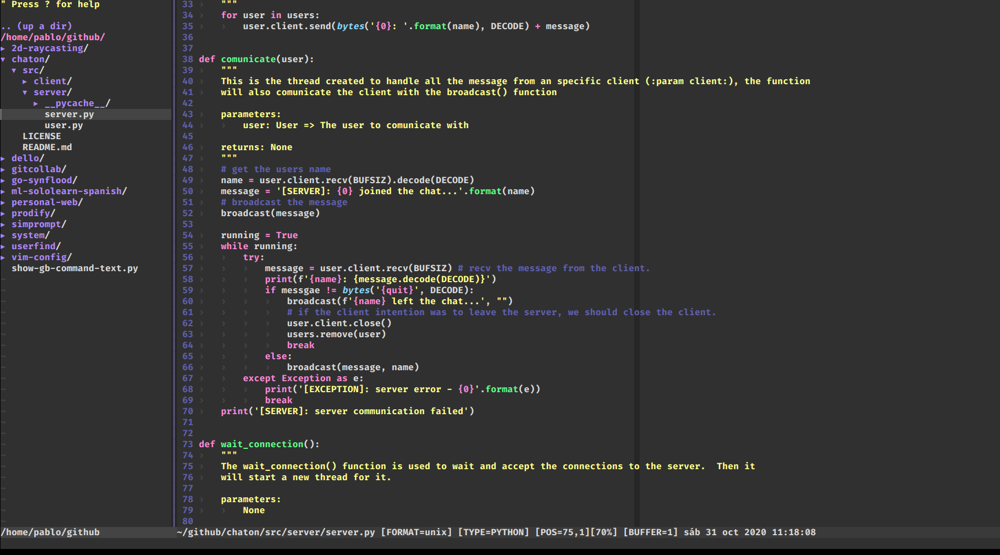
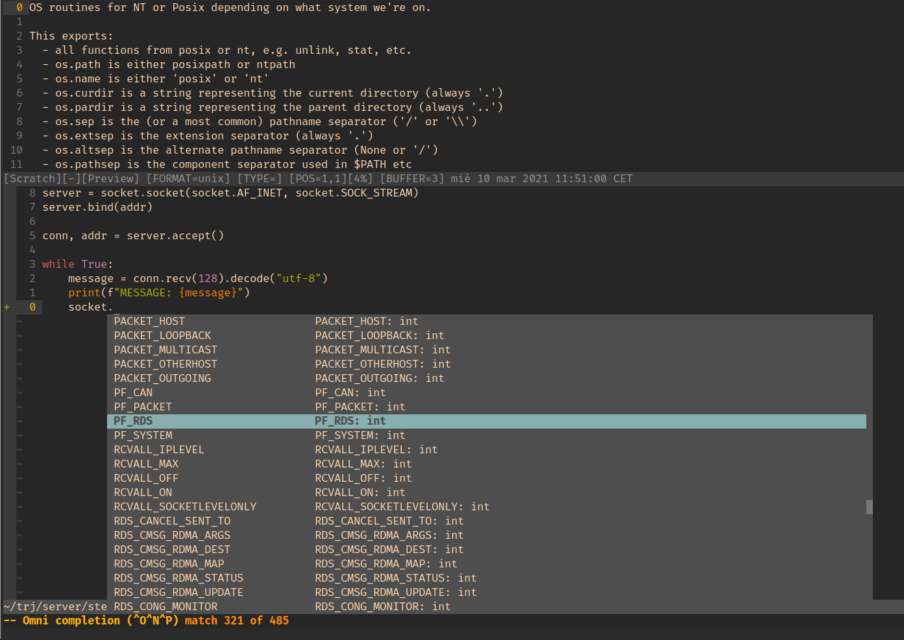

<p  align="center">
  
</p>
<h1 align="center">Vim Configuration</h1>
<h3 align="center">My personal vim configuration files</h3>
<p align="center">
  
</p>
  
In this folder I will store all the **configuration files** that have relation with my **Vim text editor**. Vim is a very configurable console text editor, so it has different files that you can use to modify. You can learn more about Vim [here](https://www.vim.org/).

As an operating system, I use [Elementary OS](https://elementary.io), so some of the settings in this repository **may not work the same on different Linux distributions** or even on different operating systems.

I use **Vundle-vim** as a plugin manager, you can read more about Vundle-vim in its GitHub [repository](https://github.com/VundleVim/Vundle.vim). You can also use another package manager like [vim-plug](https://github.com/junegunn/vim-plug).

---

<h2 align="center">About the repository</h2>                                                                                                  
<p align="center">
  
  
</p>

Vim is made up of multiple files. **I have only uploaded to this repository those that I have configured to my liking**. Let's imagine a basic file structure on linux. With vim, it would be something like this:
```
home/<user>
| ...
| .vim/
| | autoload/
| | bundle/
| | views/
| | netrwhist
| .vimrc
```
You can check the structure of vim with a simple
```shell
ls -la
```
In this repository we have uploaded the following Vim files:
| File | Description | Position |
|------|-------------|----------|
| `.vimrc` | The main configuration file for Vim | The root directory `~` |


<h2 align="center">Set up</h2>

You can set up this Vim configuration to your local machine. But you will need some **requisites**. Although Vim is 
| Name | Version |Use | Links |
|------|---------|----|-------|
| Git  | n       | CLonning this repository | [git-scm.com](https://git-scm.com/) |
| Vim  | 8+      | The Vim text editor itself | [vim.org](https://www.vim.org/) |
| Bash | 3.2+    | Running the setup | [gnu.org/software/bash](https://www.gnu.org/software/bash/) |

Although you can download VIM on [windows](windows.com) / chrome OS systems, this repository does not provide a secure way of installation for these systems, simply for those based on [Unix](https: //en.wikipedia.org/wiki/Unix).
Open a terminal and **run the following command**:
```shell
sh -c "$(curl -fsSL https://raw.githubusercontent.com/pblcc/dotfiles/main/vim/setup.sh)"
```
###### Note: This setup.sh file is still in development and may generate some errors. 

<h2 align="center">Look</h2>
<p  align="center">
  
</p>
<h3 align="center">I use some plugins to autocomplete all the syntax I need</h3>
<p  align="center">
  
</p>

I use the [dracula](https://github.com/dracula/dracula-theme) theme for vim. It's a dark theme with pastel colors.

The font I use is fira code bold. You can check it at [this repository](https://github.com/tonsky/FiraCode).

<h2 align="center">License</h2>

This repoitory is under the Apache 2.0 License. You can read it in the license file.
```
Copyright 2020 - Pablo Corbalán 

Licensed under the Apache License, Version 2.0 (the "License");
you may not use this file except in compliance with the License.
You may obtain a copy of the License at

    http://www.apache.org/licenses/LICENSE-2.0

Unless required by applicable law or agreed to in writing, software
distributed under the License is distributed on an "AS IS" BASIS,
WITHOUT WARRANTIES OR CONDITIONS OF ANY KIND, either express or implied.
See the License for the specific language governing permissions and
``
limitations under the License.
